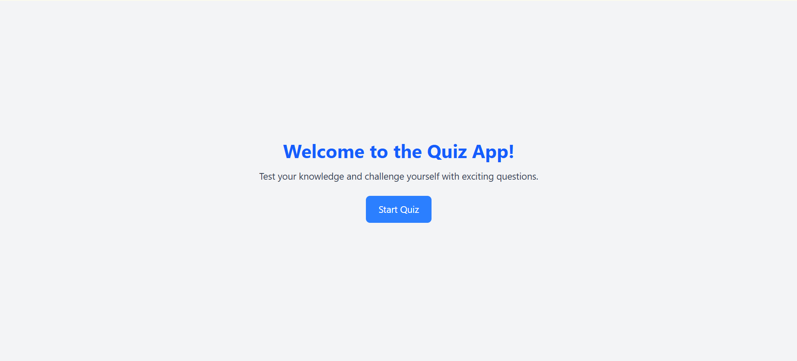
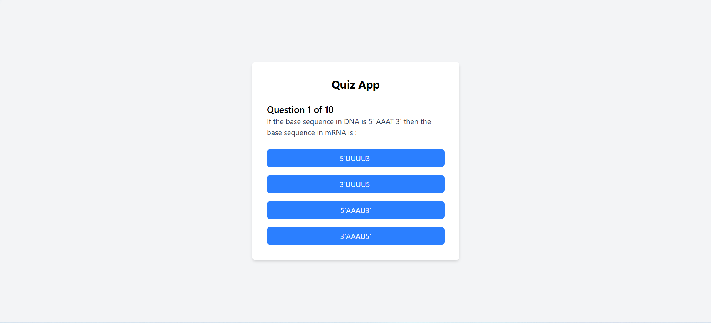
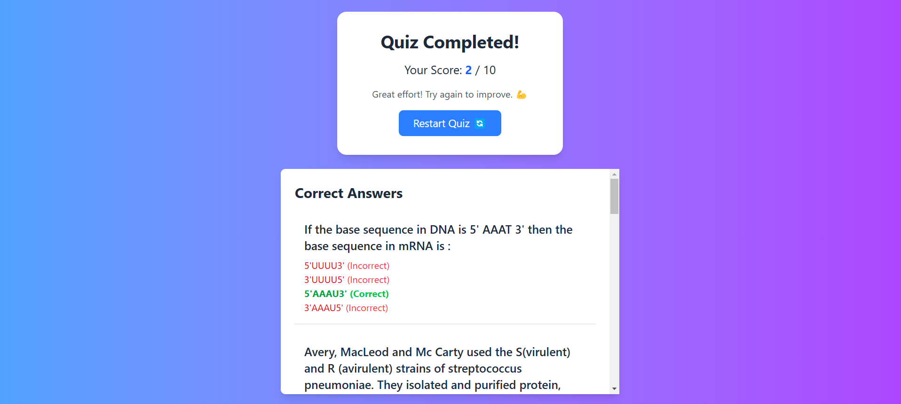

# Quiz App 🎮

This is a simple quiz application built with React, Vite, and Tailwind CSS. It fetches quiz data from an API and presents it in a gamified manner.

## Setup ⚙️

1.  Clone the repository:
git clone https://github.com/adityadhikale/quiz-app
 `cd quiz-app`
2. Install dependencies: `npm install`.
3. Run the app: `npm run dev`.

## Features ✨

- Fetch quiz data from an API 📡
- Display questions with multiple-choice answers ✅❌
- Show a summary of results upon completion 🏆

## Screenshots

### Screenshot 1

### Screenshot 2

### Screenshot 3

### Screenshot 4

🌐 **Check out the live site here:** [Quiz App](https://quizapplite-lite.netlify.app/) 💻

